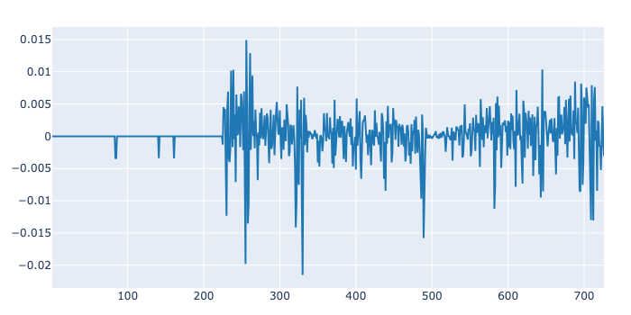
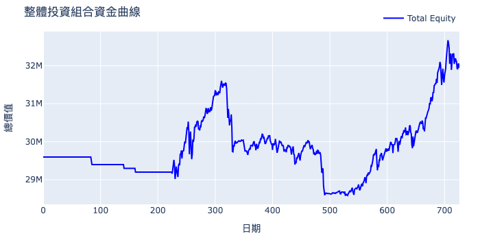

# 基於市場象限轉移之台股跨截面量化策略
### **Quadrant Regime-Switching Strategy for Taiwan Equity (Top 300)**

## 策略核心摘要 (Executive Summary)
本專案實作了一套針對 **台股前 300 大高流動性資產** 的量化交易模型。核心邏輯透過「波動 (Volatility)」與「價格擴張 (Price Expansion)」兩大維度，將市場動態切分為四個象限（Quadrants），並動態捕捉象限間的轉移訊號進行資產配置。

與傳統單一因子模型不同，本策略專注於在不同市場環境下進行自適應的權重調整，旨在維持極低的組合波動度。在回測中展現了顯著的風險調整後收益（Sharpe Ratio 0.63），具備高度的穩定性。

---

## 策略架構與實作細節

### 1. 股票池篩選 (Universe Selection)
* **流動性過濾**：僅納入台股市值前 300 大且具備高度流動性之標的。
* **實務考量**：確保模型在實盤操作時具備極高的 **資金容量 (Capacity)**，降低滑點（Slippage）對績效的侵蝕，適合法人級資金配置。

### 2. 四象限邏輯 (The Quadrant Logic)
透過定義市場狀態，進行多空力道與權重的動態調整：
* **象限 I**：低波動 + 價格擴張（穩定趨勢層級）。
* **象限 II**：高波動 + 價格擴張（過熱/轉折層級）。
* **象限 III**：高波動 + 價格縮減（恐慌性殺盤層級）。
* **象限 IV**：低波動 + 價格縮減（築底/盤整層級）。

### 3. 工程優化 (Engineering Highlights)
* **資料清理**：處理除權息、極端值過濾及存活者偏差（Survival Bias）校正。
* **架構演進**：目前採用標的序列迭代（Loop-based）回測引擎，下一階段將導入 **Vectorized Operations** 進行重構，預計將處理 300 檔標的之執行效率提升 90% 以上。

---

## 策略績效表現 (Backtest Performance)

| 績效指標 (Metrics) | 數值 (Value) | 說明 (Note) |
| :--- | :--- | :--- |
| **年化夏普值 (Sharpe Ratio)** | **0.632** | 展現優異的風險收益比 |
| **總報酬率 (Total Return)** | **7.90%** | 穩定累積的 Alpha 收益 |
| **年化報酬率 (Annualized Return)** | **3.90%** | 穩健的複利增長 |
| **年化波動度 (Annualized Vol)** | **6.369%** | 低於市場平均，極佳的下行風險控管 |
| **最大回撤 (Max Drawdown)** | **9.554%** | 風險控管於個位數邊緣，回撤極小 |
| **Sortino Ratio** | **0.832** | 著重於下行風險的保護能力 |





> **註**：回測區間涵蓋 726 天之市場多空循環，使用 300 檔高流動性標的進行跨截面模擬。

---

## 🛠️ 安裝與使用 (Installation & Usage)
1. **複製專案**：
   ```bash
   git clone [https://github.com/ehk0224/Quadrant_strategy.git](https://github.com/ehk0224/Quadrant_strategy.git)

2. **pip install -r requirements.txt**
---
Disclaimer: 本專案僅供學術研究與投資分析參考，不構成任何形式之投資建議。