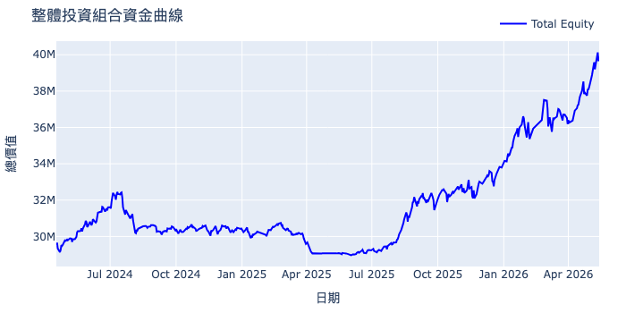
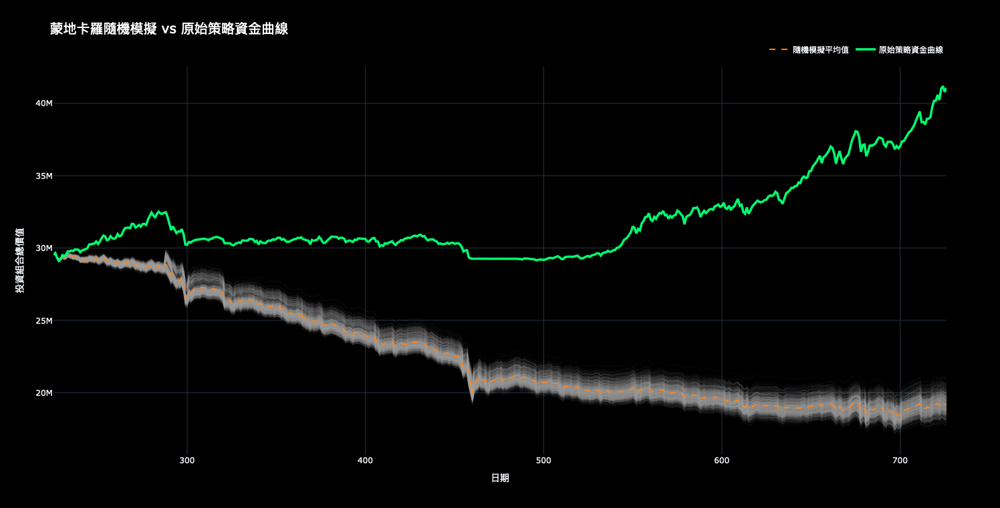
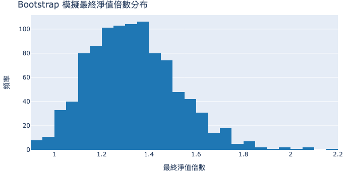
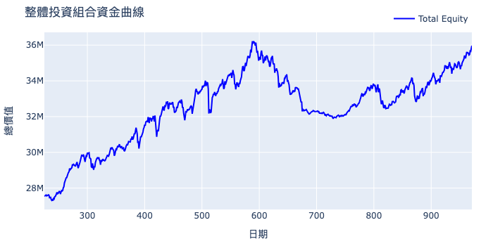
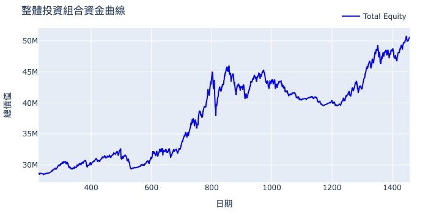
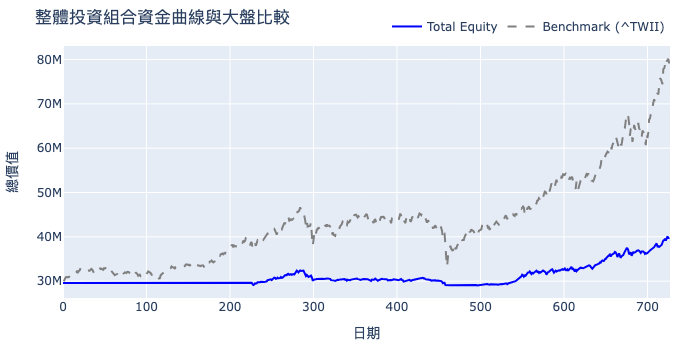

# Quadrant Regime-Switching Strategy for Taiwan Equity (Top 300)

[中文版README](./README_zh_TW.md)

## Strategy Performance

| Metrics | Value |
| :--- | :--- |
| **Total Return [%]** | 35.083834 |
| **Annualized Return [%]** | 24.4945 |
| **Annualized Volatility [%]** | 10.95015 |
| **Max Drawdown [%]** | 10.384584 |
| **Sharpe Ratio** | 2.056173 |
| **Calmar Ratio** | 2.358737 |
| **Sortino Ratio** | 2.877798 |
| **Skew** | -0.737905 |
| **Value at Risk (95% CI)** | -0.010185 |



> **Note**: The backtest covers 500 days of market cycles, utilizing a cross-sectional simulation of the top 300 highly liquid assets.

## Research Motivation

The Taiwan equity market frequently exhibits two types of price dislocations:  
1. **value opportunities** (undervalued stocks in bottoming phases)
2. **momentum opportunities** (prices pushed higher by market sentiment or capital inflows). 

Traditional single-factor strategies often capture only one of these, performing poorly during regime transitions.

This project aims to build a **long-biased systematic strategy** that captures both types of alpha by using a **four-quadrant market regime framework**.

We define market states along two key dimensions:
- **Volatility**: measuring the intensity of market sentiment
- **Price Expansion/Contraction**: measuring the direction and strength of price deviation from recent baselines

By identifying transitions between the four quadrants, the strategy dynamically adjusts positions:
- Accumulate in **bottoming/undervalued zones** (low volatility + contraction)
- Ride trends in **expansion zones** (low-to-medium volatility + expansion)
- Reduce exposure during overheating or panic phases

The goal is to combine the strengths of mean-reversion (value) and trend-following (momentum) approaches, generating robust returns across market cycles while maintaining strict risk control.

## Table of Contents

  * [Core Strategy Logic](#core-strategy-logic)
  * [In-depth Performance Analysis](#in-depth-performance-analysis)
  * [Strategy Validation and Robustness Analysis](#strategy-validation-and-robustness-analysis)
  * [Installation and Usage](#installation-and-usage)

-----

## Core Strategy Logic

This project implements a quantitative trading model focused on the **Top 300 liquid assets in the Taiwan stock market**. The core logic categorizes market dynamics into four quadrants based on two dimensions: **Volatility** and **Price Expansion/Contraction**.

Unlike traditional single-factor models, this strategy dynamically captures transition signals between quadrants to adjust asset allocation. It is an adaptive weighting system designed to maintain extremely low portfolio volatility while achieving robust risk-adjusted returns (Sharpe Ratio 2.056).

### 1\. Universe Selection

  * **Liquidity Filter**: Only stocks within the top 300 by market capitalization are included.
  * **Practical Consideration**: This ensures high **capital capacity** and minimizes **slippage**, making the strategy suitable for institutional-scale allocation.
  * **Screening Criteria**:

| Criteria Type | Threshold (Taiwan Market) | Description |
| :--- | :--- | :--- |
| Market Cap | \> 10 Billion TWD | Filters out small-caps and penny stocks. |
| Avg. Daily Value | \> 50 Million TWD | Ensures smooth entry/exit for retail or small quant funds. |
| Institutional Std. | \> 100 Million TWD | Optimized for institutional simulations with minimal slippage. |
| Daily Volume | \> 1,000 Lots (Shares) | Prevents order book gaps and ensures execution continuity. |

### 2\. The Quadrant Logic

Market states are defined to trigger entry and exit signals:

  * **Quadrant I**: High Volatility + Price Expansion (Overheating / Pivot phase).
  * **Quadrant II**: High Volatility + Price Contraction (Panic Selling phase).
  * **Quadrant III**: Low Volatility + Price Contraction (Bottoming / Consolidation phase).
  * **Quadrant IV**: Low Volatility + Price Expansion (Stable Trend phase).

-----

## In-depth Performance Analysis

### 1\. Descriptive Statistics

The **Total Return of 35.08%** over 726 days (including a 225-day burn-in period) reflects an **Annualized Return of 24.49%**, demonstrating consistent long-term profitability. With an **Annualized Volatility of 10.95%**, the equity curve remains exceptionally stable with minimal fluctuations.

  * **Risk-Adjusted Return**: A **Sharpe Ratio of 2.056** indicates a healthy balance between risk and reward. The **Sortino Ratio (2.878)** outperforms the Sharpe Ratio, suggesting the strategy is particularly effective at mitigating downside risk compared to overall volatility.

  * **Drawdown & Resilience**: The **Max Drawdown (MDD) of 10.38%** highlights the strategy’s conservative nature. However, the **Max Drawdown Duration of 299 days** (nearly a year) indicates a long recovery period, which tests investor patience during stagnation.

  * **Distribution Profile**: A **Kurtosis of 2.45** (expressed as excess kurtosis) confirms that the strategy exhibits a "fat-tail" (leptokurtic) distribution, where extreme events occur more frequently than in a normal distribution. However, when compared to the market benchmark's kurtosis of 7.68, the strategy demonstrates significantly reduced tail risk, indicating a more stable return profile under extreme market conditions. Meanwhile, a **Tail Ratio of 0.861** shows relative symmetry between extreme gains and losses, and the 95% **VaR of -0.01%** further highlights that daily downside risk is strictly managed.

### 2\. Equity Curve Analysis (Backtest: May 2024 – May 2026)

Excluding the burn-in period, the equity curve illustrates three distinct phases:

1.  **Phase 1: Initial Alpha & Market Entry (Mid-2024)**:
      * **Performance**: Assets rose steadily from the 29.6M baseline to a peak of approximately 32.5M.
      * **Description**: This marked the strategy's "initial dividend period," where the system successfully captured early-stage trend signals and established a positive capital cushion.
2.  **Correction, Consolidation & Resilience (Mid-2024 – Mid-2025)**:
      * **Performance**: The strategy experienced its Maximum Drawdown (MDD) of ~10.38%, with equity dipping to a low of approximately 29M before entering a prolonged lateral plateau.
      * **Market Context**: Following the AI-driven surge in 2024, the market transitioned into a high-volatility "price contraction" phase in 1H 2025. Geopolitical uncertainty surrounding the post-2024 US election and shifting Fed interest rate expectations led to significant market washouts. This resulted in an underwater period of approximately 360–450 days.
      * **Optimization Path**: This phase highlighted the necessity of defensive stability. Future iterations will integrate Dynamic Position Sizing and Advanced Money Management modules to further mitigate friction costs during non-trend environments.
3.  **Phase 3: Exponential Growth & Price Expansion (Late 2025 – May 2026)**:
      * **Performance**: The equity curve resumed a powerful upward trajectory, decisively breaking through the 35M resistance and hitting a new all-time high above 40M in May 2026.
      * **Macro Drivers**: As the market matured in 2026, the 2nm mass production cycle and a global electronic hardware replacement wave drove a massive "price expansion" phase. This provided high-conviction entry signals that the strategy successfully capitalized on.
      * **Adaptability**: The steep, step-like ascent during this period demonstrates the strategy’s exceptional ability to capture high-velocity rallies led by blue-chip technology stocks, achieving a total return of +35.5% from the inception point.

-----

## Strategy Validation and Robustness Analysis
To ensure the strategy's performance is driven by structural logic rather than random noise or over-optimization, we conducted the following statistical tests:

### 1. Monte Carlo Benchmark (Statistical Significance)

This test compares the strategy’s performance against 1,000 random trading paths (shuffling entry/exit while maintaining the same frequency).

- Benchmark Parameters:
  - Daily Entry Probability: 0.2166
  - Daily Exit Probability: 0.3611

- Results:
  - Portfolio Sharpe Ratio: 2.056
  - Mean Sharpe Ratio of Random Simulations: -1.3842
  - P-Value: 0.0010 (p<0.05)



Conclusion: The strategy’s performance is statistically significant. With a p-value of 0.1%, we can reject the null hypothesis that the returns are generated by chance, confirming a genuine edge in the logic.

### 2. Block Bootstrap (Robustness Testing)

We utilized a Block Bootstrap method to assess how the strategy performs under different historical sequences, accounting for time-series look-ahead bias and serial correlation.

- Simulation Setup:
  - Iterations: 1,000
  - Block Size: 20 days

- Key Metrics:
  - Mean Final Equity Multiple: 1.33x
  - Median Final Equity Multiple: 1.32x
  - 90% Confidence Interval: [1.05x,1.67x]
  - Probability of Loss (Final Equity < 1): 1.9%



Conclusion: The strategy demonstrates high resilience across reshuffled market regimes. In 1,000 paths, 98.3% ended in a profit, with the 90% confidence interval remaining strictly above the break-even line.

### 3. Out-of-Sample (OOS) Test

To verify that the strategy retains its efficacy on data not used during the parameter optimization phase, we conducted tests across two distinct periods.

| Metrics | 2016 – 2019 (Early OOS) | 2018 – 2023 (Long-term OOS) |
| :--- | :--- | :--- |
| Annualized Return	| 13.94%	| 18.35% |
| Annualized Volatility	| 9.34%	| 13.41% |
| Sharpe Ratio	| 1.45	| 1.32 |
| Sortino Ratio	| 1.94	| 1.78 |
| Max Drawdown	| 11.96%	| 15.75% |
| Calmar Ratio	| 1.17	| 1.16 |

**(2016-2019)**


**(2018-2023)**


Conclusion: The strategy exhibits remarkable consistency. Maintaining a Sharpe Ratio above 1.2 across different market cycles suggests strong generalization and minimal overfitting.

### 4. Benchmark Comparison

Evaluated the strategy's risk-adjusted excess returns relative to the **Taiwan Capitalization Weighted Stock Index (^TWII)**.

- Beta (Systemic Risk): 0.24
  - The strategy shows very low correlation with the broader market, indicating a highly idiosyncratic return profile.

- Alpha (Annualized Excess Return): 6%
  - After adjusting for market risk, the strategy generates a consistent annual surplus of approximately 6%.



Conclusion: The combination of a low Beta and high Alpha confirms that the strategy does not rely on market beta (general upward trends) for profit. Instead, it captures structural alpha through its specific logic.

-----

## Installation and Usage

<details>
<summary><b>Click to expand instructions</b></summary>
<br>

1.  **Clone the repository**:

    ```bash
    git clone https://github.com/ehk0224/Quadrant_strategy.git
    ```

2.  **Install dependencies**:

    ```bash
    pip install -r requirements.txt
    ```

</details>

-----

**Disclaimer**: This project is for academic research and investment analysis purposes only and does not constitute financial advice. Parts of the analysis were assisted by AI and meticulously reviewed/optimized by the author.

### Intellectual Property Statement

This project, including all algorithms, strategy logic (specifically the Quadrant analysis), and backtesting frameworks, was independently developed by the author between January 1, 2026, and May 15, 2026.

All rights reserved. This project constitutes Pre-hire Intellectual Property and is explicitly excluded from any future employment-related invention assignments.

Digital Signature (SHA-256):
82ecdb400e1f84506d84115322e91bd1a01fec52ca7dd6388ce16bec986e8ca6
Verification snapshot of the full source code (including proprietary modules) taken on 2026-05-15.