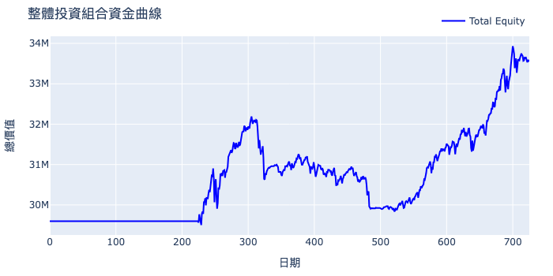

# Quadrant Regime-Switching Strategy for Taiwan Equity (Top 300)

[中文版README](./README_zh_TW.md)

## Strategy Performance

| Metrics | Value |
| :--- | :--- |
| **Total Return [%]** | 13.456098 |
| **Annualized Return [%]** | 6.562152 |
| **Annualized Volatility [%]** | 5.539781 |
| **Max Drawdown [%]** | 7.307277 |
| **Sharpe Ratio** | 1.17511 |
| **Skew** | -0.89113 |
| **Value at Risk (95% CI)** | -0.004321 |



> **Note**: The backtest covers 725 days of market cycles, utilizing a cross-sectional simulation of the top 300 highly liquid assets.

## Table of Contents

  * [Core Strategy Logic](#core-strategy-logic)
  * [In-depth Performance Analysis](#in-depth-performance-analysis)
  * [Installation and Usage](#installation-and-usage)

-----

## Core Strategy Logic

This project implements a quantitative trading model focused on the **Top 300 liquid assets in the Taiwan stock market**. The core logic categorizes market dynamics into four quadrants based on two dimensions: **Volatility** and **Price Expansion/Contraction**.

Unlike traditional single-factor models, this strategy dynamically captures transition signals between quadrants to adjust asset allocation. It is an adaptive weighting system designed to maintain extremely low portfolio volatility while achieving robust risk-adjusted returns (Sharpe Ratio 1.1751).

### 1\. Universe Selection

  * **Liquidity Filter**: Only stocks within the top 300 by market capitalization are included.
  * **Practical Consideration**: This ensures high **capital capacity** and minimizes **slippage**, making the strategy suitable for institutional-scale allocation.
  * **Screening Criteria**:

| Criteria Type | Threshold (Taiwan Market) | Description |
| :--- | :--- | :--- |
| Market Cap | \> 10 Billion TWD | Filters out small-caps and penny stocks. |
| Avg. Daily Value | \> 50 Million TWD | Ensures smooth entry/exit for retail or small quant funds. |
| Institutional Std. | \> 100 Million TWD | Optimized for institutional simulations with minimal slippage. |
| Daily Volume | \> 1,000 Lots (Shares) | Prevents order book gaps and ensures execution continuity. |

### 2\. The Quadrant Logic

Market states are defined to trigger entry and exit signals:

  * **Quadrant I**: High Volatility + Price Expansion (Overheating / Pivot phase).
  * **Quadrant II**: High Volatility + Price Contraction (Panic Selling phase).
  * **Quadrant III**: Low Volatility + Price Contraction (Bottoming / Consolidation phase).
  * **Quadrant IV**: Low Volatility + Price Expansion (Stable Trend phase).

-----

## In-depth Performance Analysis

### 1\. Descriptive Statistics

The **Total Return of 13.46%** over 725 days (including a 225-day burn-in period) reflects an **Annualized Return of 6.56%**, demonstrating consistent long-term profitability. With an **Annualized Volatility of 5.54%**, the equity curve remains exceptionally stable with minimal fluctuations.

  * **Risk-Adjusted Return**: A **Sharpe Ratio of 1.175** indicates a healthy balance between risk and reward. The **Sortino Ratio (1.618)** outperforms the Sharpe Ratio, suggesting the strategy is particularly effective at mitigating downside risk compared to overall volatility.

  * **Drawdown & Resilience**: The **Max Drawdown (MDD) of 7.31%** highlights the strategy’s conservative nature. However, the **Max Drawdown Duration of 358 days** (nearly a year) indicates a long recovery period, which tests investor patience during stagnation.

  * **Distribution Profile**: A negative **Skewness (-0.89)** suggests a "left-skewed" distribution—frequent small gains occasionally interrupted by larger single-day losses. A **Kurtosis of 7.89** indicates a "fat-tail" distribution, where extreme events occur more frequently than in a normal distribution. However, a **Tail Ratio of 1.066** shows relative symmetry between extreme gains and losses. The **VaR (-0.43%)** confirms that, at a 95% confidence level, the expected maximum daily loss will not exceed 0.43%.

### 2\. Equity Curve Analysis (Backtest: April 2024 – April 2026)

Excluding the burn-in period, the equity curve illustrates three distinct phases:

1.  **Phase 1: Initial Growth (Day 220 - 300)**: Assets rose rapidly from 30M to over 32M, marking the strategy's "dividend period."
2.  **Phase 2: Correction & Consolidation (Day 300 - 500)**: The strategy experienced its maximum drawdown of \~7% and entered a lateral plateau.
      * **Market Context**: Following the AI sector surge in 2024, the market entered a high-volatility "price contraction" phase in 1H 2025. Frequent stop-losses or a lack of entry signals led to a **358-day underwater period**.
      * **Macro Factors**: Geopolitical uncertainty post-2024 US election and market anticipation regarding the Fed’s interest rate pivots led to significant washouts mid-2025. This aligns with the sharp dip near Day 480.
      * **Optimization Path**: Future iterations will integrate **Dynamic Position Sizing** and **Money Management** modules to enhance defense during consolidation phases.
3.  **Phase 3: Strong Recovery (Day 500 - 725)**: The equity curve resumed its upward trajectory, hitting a new high above 33.5M in Q1 2026.
      * **New Tech Cycle**: As the market transitioned into 2026, the 2nm mass production cycle and electronic hardware replacement wave drove a "price expansion" phase, triggering strong entry signals.
      * **Adaptability**: The steep, step-like ascent demonstrates the strategy’s success in capturing the rally led by blue-chip stocks during this period.

-----

## Installation and Usage

<details>
<summary><b>Click to expand instructions</b></summary>
<br>

1.  **Clone the repository**:

    ```bash
    git clone https://github.com/ehk0224/Quadrant_strategy.git
    ```

2.  **Install dependencies**:

    ```bash
    pip install -r requirements.txt
    ```

</details>

-----

**Disclaimer**: This project is for academic research and investment analysis purposes only and does not constitute financial advice. Parts of the analysis were assisted by AI and meticulously reviewed/optimized by the author.