# Quadrant Regime-Switching Strategy for Taiwan Equity (Top 300)

[中文版README](./README_zh_TW.md)

## Performance Overview
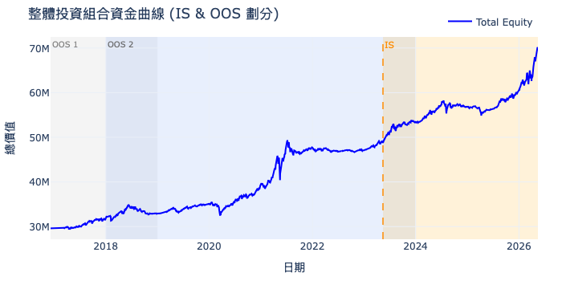
> **Note**: The backtest period spans a 10-year market bull/bear cycle, using 300 highly liquid assets for cross-sectional simulation.

| Performance Metrics                       | Full Period | In-Sample  | Out-of-Sample | Out-of-Sample |
| :---------------------------------------- | :---------- | :--------- | :------------ | :------------ |
| **Period**                                | 2016-2026   | 2023-2026  | 2018-2023     | 2016-2019     |
| **CAGR [%]**                              | 10.20       | 22.58      | 11.52         | 6.32          |
| **Annualized Volatility [%]**             | 7.86        | 12.54      | 9.17          | 5.80          |
| **Max Drawdown [%]**                      | 11.83       | 7.93       | 12.97         | 6.18          |
| **Sharpe Ratio**                          | 1.79        | 2.20       | 1.70          | 1.46          |
| **Calmar Ratio**                          | 1.24        | 3.87       | 1.27          | 1.41          |
| **Sortino Ratio**                         | 2.51        | 3.24       | 2.39          | 2.02          |
| **Beta**                                  | 0.24        | 0.30       | 0.29          | 0.28          |
| **Alpha**                                 | 0.06        | 0.10       | 0.07          | 0.04          |
| **Value at Risk (95% CI)**                | -0.006      | -0.009     | -0.006        | -0.005        |


## **Table of Contents**
* [Strategy Logic](#strategy-logic)
* [Data and Validation Methods](#data-and-validation-methods)
* [Detailed Backtest Results and Robustness Validation](#detailed-backtest-results-and-robustness-validation)
* [Risks and Limitations](#risks-and-limitations)
* [Installation and Usage](#installation-and-usage)


## Strategy Logic
### I. Research Motivation
Two common price deviation phenomena in the Taiwan Stock Market: 
1. **Value-oriented opportunities** (Undervalued prices, in the bottoming phase).
2. **Momentum-oriented opportunities** (Rapid price expansion driven by market sentiment or capital inflows).

Traditional single-factor strategies often capture only one of these and easily fail during market shifts. The core concept of this strategy is to capture both alpha sources simultaneously through a **four-quadrant framework**, creating a systematic long-biased strategy tailored for the Taiwan Stock Market.

Market states are defined along two core dimensions:
1. **Price Volatility**: Measures the intensity of market sentiment.
2. **Price Expansion/Contraction**: Measures the direction and magnitude of price deviation relative to recent baselines.
 
This design aims to capture both "value reversion" and "trend continuation" profit models, maintaining stable positive returns across different market phases while effectively controlling downside risk.

### II. Stock Pool Selection

* **Liquidity Filtering**: Includes only the top 300 stocks by market capitalization in the Taiwan Stock Market with high liquidity.
* **Practical Considerations**: Ensures the model maintains high capacity during live trading, mitigating performance erosion from slippage, making it suitable for institutional-grade capital allocation.
* **Selection Criteria**:  

| Metric Type | Selection Threshold (Taiwan Market) | Description |
| :--- | :--- | :--- |
| Market Cap | > 10 Billion TWD | Excludes small-cap and low-priced turnaround stocks. |
| Avg Daily Turnover | > 50 Million TWD | Ensures smooth execution for retail or small-scale quantitative models. |
| Avg Daily Turnover (High Standard) | > 100 Million TWD | Suitable for simulating low-slippage environments in backtests (e.g., institutional level). |
| Trading Volume | > 1,000 Lots (1M shares) | Ensures continuous order book depth during trading hours without order book gaps. |


### III. Four-Quadrant Logic
Defines market states to determine entry and exit signals:
* **Quadrant I**: High Volatility + Price Expansion (Overheated / Turning Point Level).
* **Quadrant II**: High Volatility + Price Contraction (Panic Selling Level).
* **Quadrant III**: Low Volatility + Price Contraction (Bottoming / Consolidation Level).
* **Quadrant IV**: Low Volatility + Price Expansion (Stable Trend Level).

## Data and Validation Methods

### I. Data Period and IS/OOS Split

- This strategy employs a framework of "Recent Data Training (Model Calibration) with Long-term Historical Out-of-Sample Validation (Historical OOS / Stress Test)":

1. **In-Sample / Training Period (2023–2026):** Given recent shifts in market microstructure and volatility, recent data is used as the training set to ensure the strategy logic precisely captures Alpha in the "current market environment."
2. **Historical OOS Validation Period (2016–2023):** The calibrated strategy is backtested against the preceding 8 years as a historical OOS test—covering events such as the 2020 COVID liquidity shock and the 2022 bear market—to ensure high robustness and survivability across diverse market cycles.

### II. Parameter Optimization
- Grid Search is utilized.

### III. Validation Methods
1. **Cross-section (Asset) Permutation**
- Randomly shuffles "holding signals" across different assets.

    > **H0**: The strategy's superior performance is merely a result of randomly picking specific stocks.<br>**H1**: The strategy's stock selection rules possess genuine Alpha.

- Result: Statistically Significant.
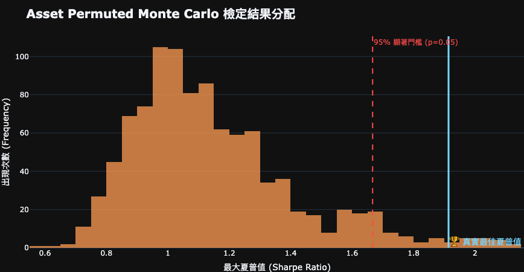

2. **Stationary Bootstrap**
- Preserves time-series dependence by resampling continuous blocks.

    > **H0**: The strategy's superior performance is merely due to fortunate alignment with specific time series structures.<br>**H1**: The strategy's performance significantly outperforms the predictive capability of random holding structures.

- Result: Not Statistically Significant.
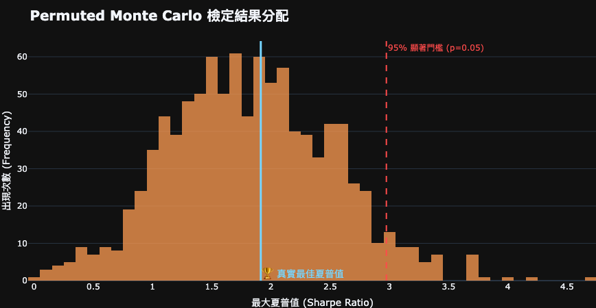

## Detailed Backtest Results and Robustness Validation

### I. Equity Curves
| In-Sample <br>2023/05/15-2026/05/15 | Early OOS <br> 2016/01/01-2019/12/31 | Long-term OOS <br> 2018/01/01-2023/12/31 |
| :--- | :--- | :---|
| 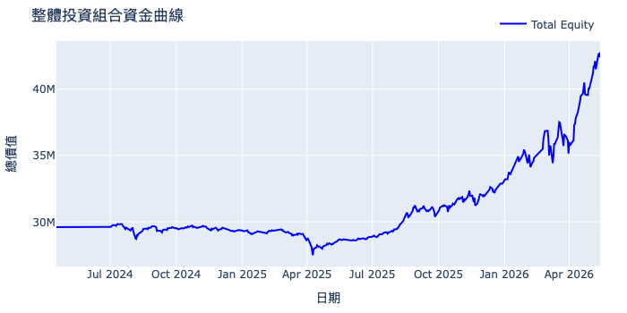 | 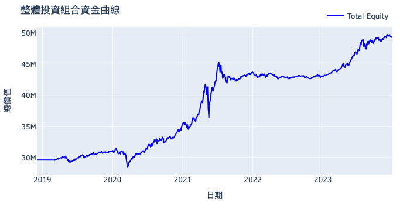 | 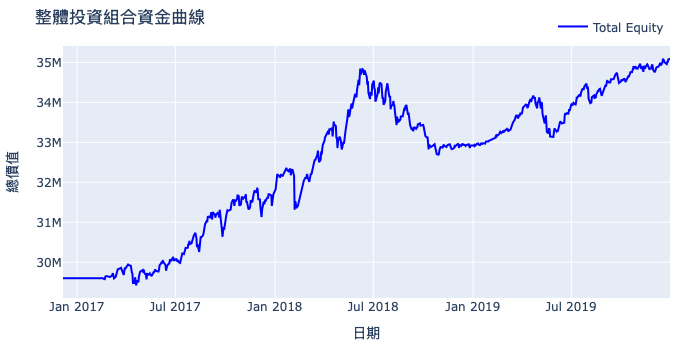 |

### II. Random Entry/Exit Monte Carlo

Validates the superiority of the strategy logic through random entry/exit simulations (maintaining the same entry frequency as the original strategy).

| In-Sample <br>2023/05/15-2026/05/15 | Long-term OOS <br> 2018/01/01-2023/12/31 | Early OOS <br> 2016/01/01-2019/12/31 |
| :--- | :--- | :---|
| 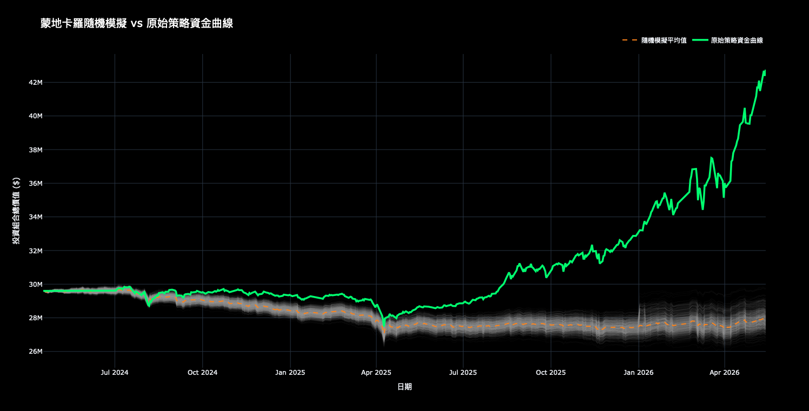 | 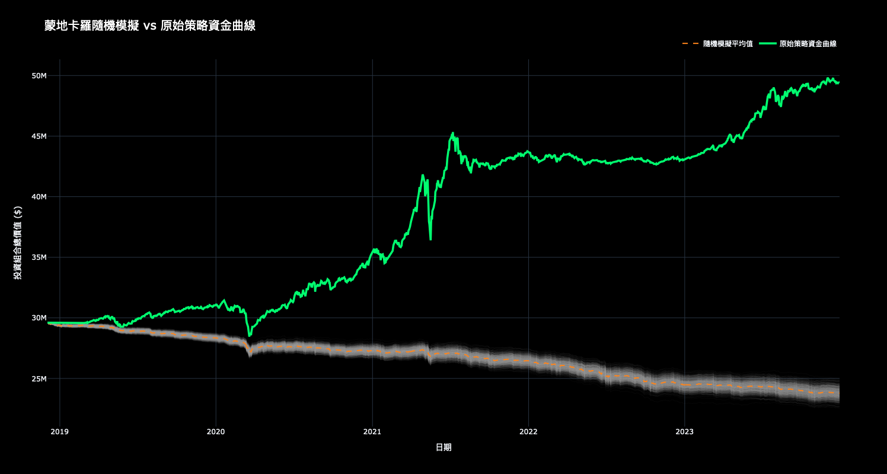 | 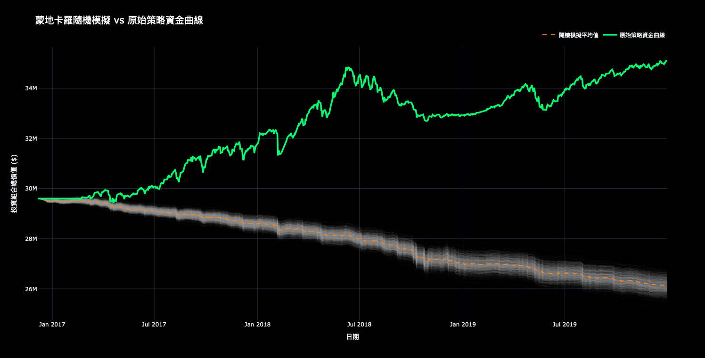 |
| Daily Entry Prob: 0.0314<br>Daily Exit Prob: 0.2222 | Daily Entry Prob: 0.0271<br>Daily Exit Prob: 0.2814 | Daily Entry Prob: 0.0242<br>Daily Exit Prob: 0.2946 |
| Strategy Portfolio Sharpe Ratio: 2.1962 | Strategy Portfolio Sharpe Ratio: 1.7034 | Strategy Portfolio Sharpe Ratio: 1.4633 |
| Random Simulation Avg Sharpe Ratio: -1.1350 | Random Simulation Avg Sharpe Ratio: -3.0767 | Random Simulation Avg Sharpe Ratio: -4.8352 |
| P-Value: 0.001 (p<0.05) | P-Value: 0.001 (p<0.05) | P-Value: 0.001 (p<0.05) |


### III. Block Bootstrap

Uses Block Bootstrap to reorder historical data and test the strategy's resilience across different temporal environments.

1. **Iterations: 1,000, Block Size: 1 Day**

| Metrics | In-Sample <br>2023/05/15-2026/05/15 | Long-term OOS <br> 2018/01/01-2023/12/31 | Early OOS <br> 2016/01/01-2019/12/31 |
| :--- | :--- | :---| :--- |
| Distribution | 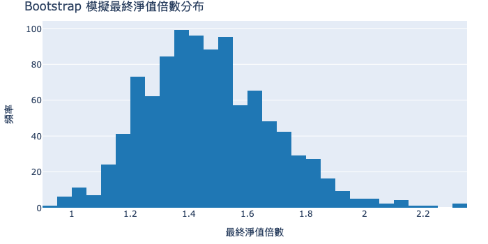 | 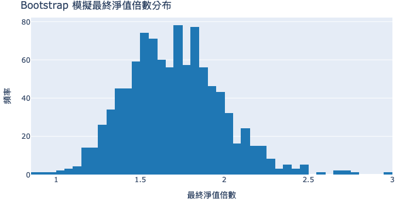 | 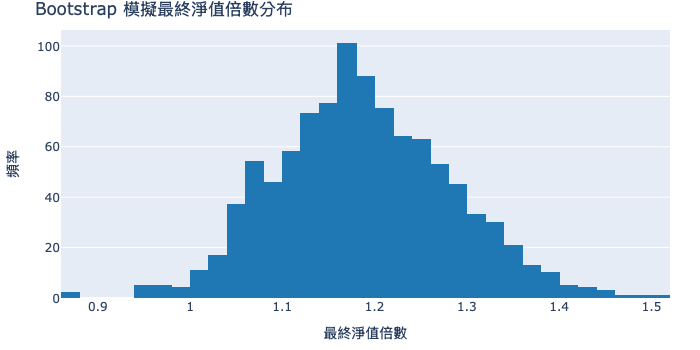 |
| Mean Final Equity Multiple | 1.47x | 1.70x | 1.19x |
| Median Final Equity Multiple | 1.44x | 1.69x | 1.18x |
| 90% Confidence Interval | [1.15x, 1.84x] | [1.28x, 2.19x] | [1.05x, 1.35x] |
| Probability of Final Loss | 0.7% | 0.3% | 1.6% |


2. **Iterations: 1,000, Block Size: 20 Days**

| Metrics | In-Sample <br>2023/05/15-2026/05/15 | Long-term OOS <br> 2018/01/01-2023/12/31 | Early OOS <br> 2016/01/01-2019/12/31 |
| :--- | :--- | :---| :--- |
| Distribution | 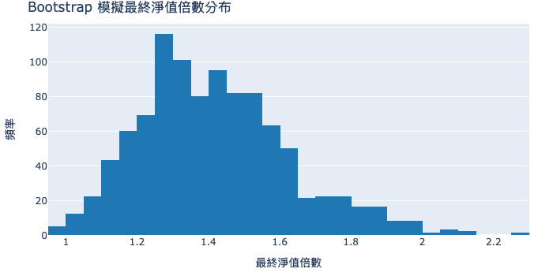 | 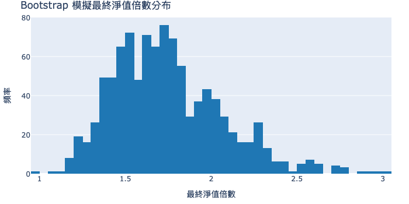 | 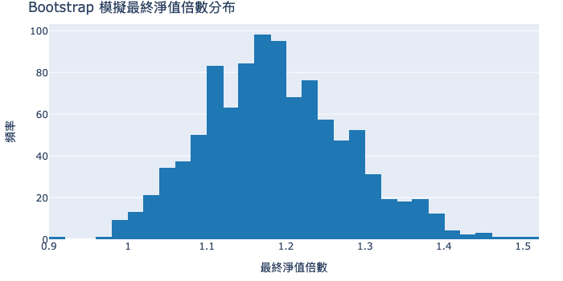 |
| Mean Final Equity Multiple | 1.42x | 1.75x | 1.19x |
| Median Final Equity Multiple | 1.39x | 1.71x | 1.18x |
| 90% Confidence Interval | [1.11x, 1.81x] | [1.31x, 2.31x] | [1.04x, 1.35x] |
| Probability of Final Loss | 0.5% | 0.1% | 1.1% |

  

## Risks and Limitations
1. **Limited Timing Predictive Power**: Stationary Bootstrap and time-series dependency tests show that the strategy does not possess a significant edge in entry/exit timing. Strategy performance is sensitive to market path; if future return sequence time structures deviate significantly from historical samples, actual performance may diverge noticeably from backtest results.
2. **Cross-Sectional Edge May Decay with Structural Shifts**: Cross-section Permutation tests indicate that the strategy possesses stock selection/exclusion capabilities. However, this edge relies on current asset correlations, sector rotation, and risk premium structures. If market regimes shift permanently (e.g., factor decay, liquidity structural changes, or regulatory changes), cross-sectional alpha may diminish.
3. **Limited Out-of-Sample Validation Window**: Although single or multi-period OOS Bootstrap results show significant positive expectation, OOS periods remain relatively limited. This cannot fully rule out luck stemming from specific market environments (such as specific volatility or trend regimes). Further validation across longer periods and additional market regimes remains necessary.
4. **Parameter Optimization and Multiple Testing Risk**: Parameter tuning was involved during strategy development. Although mitigated using permutation and bootstrap methods, data-snooping risk cannot be entirely eliminated. Re-optimizing parameters frequently based on the latest data should be avoided in practice.
5. **Transaction Costs, Slippage, and Liquidity Constraints**: Backtest results generally do not fully account for real-world impact costs, slippage, and execution failures. While medium-to-low frequency strategies have lower turnover, actual costs during market stress or in illiquid assets may significantly exceed backtest assumptions, eroding net returns.
6. **Long-term Sample Does Not Eliminate Path Dependency Risk**: The backtest covers approximately 10 years of data, showing positive expected returns across most sub-periods. However, Stationary Bootstrap results indicate performance sensitivity to specific time paths. While a 10-year sample provides substantial reference value, it cannot cover all potential structural shifts or tail-risk scenarios, and future performance may still deviate.
7. **Model Risk and Black Swan Events**: The strategy relies on historical statistical relationships, offering limited defense against extreme market events (such as sudden liquidity drains, policy shocks, or systemic risks). Backtests and simulations cannot anticipate unseen risk factors.
8. **Limitations of Benchmarks and Comparisons**: The strategy outperforms certain random holding structures or simple benchmarks, but this does not guarantee consistent outperformance against broader market indices long term. Investors should evaluate performance based on individual risk tolerance and portfolio allocation context rather than relying solely on historical Sharpe ratios or equity curves.
-----

## Installation and Usage

<details>
<summary><b>Click to expand instructions</b></summary>
<br>

1.  **Clone the repository**:

    ```bash
    git clone https://github.com/ehk0224/Quadrant_strategy.git
    ```

2.  **Install dependencies**:

    ```bash
    pip install -r requirements.txt
    ```

</details>

-----

**Disclaimer**: This project is for academic research and investment analysis purposes only and does not constitute financial advice. Parts of the analysis were assisted by AI and meticulously reviewed/optimized by the author.

### Intellectual Property Statement

This project, including all algorithms, strategy logic (specifically the Quadrant analysis), and backtesting frameworks, was independently developed by the author between January 1, 2026, and July 24, 2026.

All rights reserved. This project constitutes Pre-hire Intellectual Property and is explicitly excluded from any future employment-related invention assignments.

Digital Signature (SHA-256):
a06eae2ec81ba574fdbdccb09ecb9162880c9bbf240033ad3808731f66939df9
Verification snapshot of the full source code (including proprietary modules) taken on 2026-07-24.