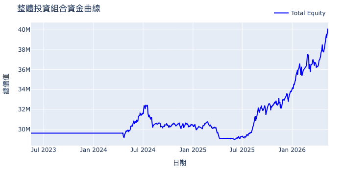
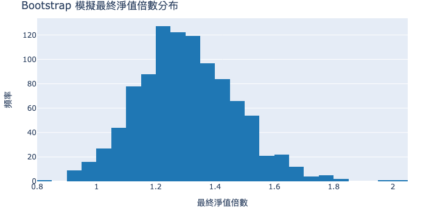
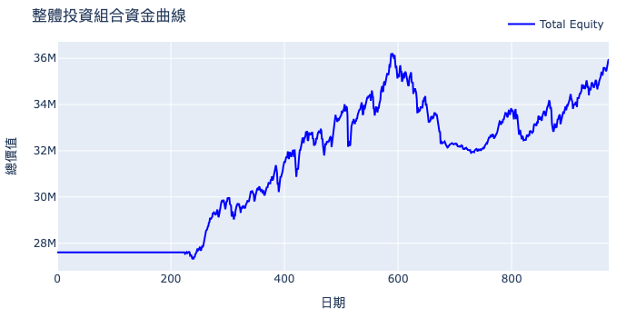
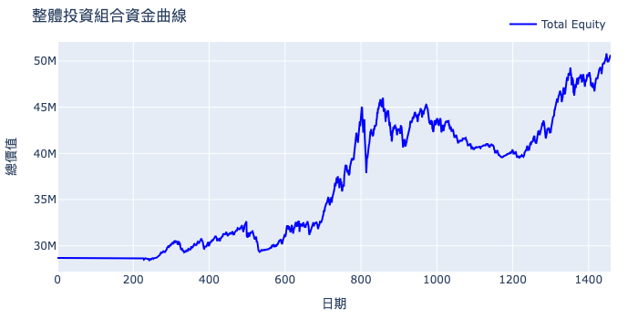

# 基於象限轉移之台股量化策略

[英文版README](./README.md)

## 策略績效表現
| 績效指標 (Metrics) | 數值 (Value) |
| :--- | :--- |
| **Total Return [%]** | 34.742857 |
| **Annualized Return [%]** | 16.174187 |
| **Annualized Volatility [%]** | 9.112297 |
| **Max Drawdown [%]** | 10.384584 |
| **Sharpe Ratio** | 1.691185 |
| **Calmar Ratio** | 1.557519 |
| **Sortino Ratio** | 2.370197 |
| **Skew** | -0.760228 |
| **Value at Risk (95% CI)** | -0.007993 |


> **註**：回測區間涵蓋 726 天之市場多空循環，使用 300 檔高流動性標的進行跨截面模擬。

## 目錄
* [策略核心邏輯](#策略核心邏輯)
* [績效深度分析](#績效深度分析)
* [策略驗證與穩健性評估](#策略驗證與穩健性評估)
* [安裝與使用](#安裝與使用)


## 策略核心邏輯

本專案實作了一套針對 **台股前 300 大高流動性資產** 的量化交易模型。核心邏輯透過「波動 」與「價格擴張 」兩大維度，將市場動態切分為四個象限，並動態捕捉象限間的轉移訊號進行資產配置。與傳統單一因子模型不同，本策略專注於在不同市場環境下進行自適應的權重調整，旨在維持極低的組合波動度。在回測中展現了顯著的風險調整後收益（Sharpe Ratio 1.691），具備高度的穩定性。

### 1. 股票池篩選
* **流動性過濾**：僅納入台股市值前 300 大且具備高度流動性之標的。
* **實務考量**：確保模型在實盤操作時具備極高的 **資金容量 (Capacity)**，降低滑點（Slippage）對績效的侵蝕，適合法人級資金配置。
* **篩選標準**：

| 指標類型 | 篩選門檻 (台股環境) | 說明 |
| :--- | :--- | :--- |
| 市值 (Market Cap) | > 100 億 TWD | 剔除小型股、低價轉機股。 |
|日均成交值	|> 5,000 萬 TWD	|確保一般散戶或小規模量化模型進出無礙。|
|日均成交值 (高標準)	|> 1 億 TWD	|適合回測時模擬較低滑價的環境（如法人級別）。|
|成交量 (Volume)	|> 1,000 張	|確保盤中掛單連續，不會出現五檔斷層。|

### 2. 四象限邏輯
透過定義市場狀態，決定出場、入場訊號：
* **象限 I**：高波動 + 價格擴張（過熱/轉折層級）。
* **象限 II**：高波動 + 價格縮減（恐慌性殺盤層級）。
* **象限 III**：低波動 + 價格縮減（築底/盤整層級）。
* **象限 IV**：低波動 + 價格擴張（穩定趨勢層級）。

## 績效深度分析

### 1. 描述性統計

總報酬率34.74%，顯示在726天內（含225天暖機期）資產增值了約 34.74%。將總報酬轉換為每年的複利成長率，年化報酬率約為 16.17%，反映了策略的長期獲利能力。年化波動率9.11%，顯示資金曲線非常平穩，沒有大幅度的上下震盪。

衡量每單位總風險所能換取之超額報酬，Sharpe Ratio 約為1.691，顯示風險與報酬相對平衡。針對下行風險（虧損）之評估，Sortino Ratio (2.37) 比Sharpe Ratio高，顯示此策略在避開虧損方面的表現優於對應整體波動的表現。年化報酬率除以最大回撤Calmar Ratio (1.558)，反映了策略在獲利與最大潛在虧損之間的性價比。數值大於 1，表現尚可。

在高風險的情況下，最大回撤為10.38%，顯示資產從最高點跌落到最低點的最大幅度，表現出此策略穩健的特性。惟最大回撤持續時間接近一年（約 299 天），資產從回落到創新高耗時良久，考驗投資人耐心。

從統計分佈來看，因為偏度 (-0.76)為負，代表報酬分布呈現「左偏」，即平時小賺多，但偶爾會出現較大的單日虧損。峰度 (4.62)屬於「肥尾」分布，代表極端事件（暴漲或暴跌）發生的機率高於常態分布。然而，尾部比率 (1.044)接近1，代表兩端風險相對對稱。VaR (-0.008%)顯示在95% 的信心水準，單日預計的最大虧損不會超過 0.008%。

### 2. 資金損益曲線分析（回推 726 天，約 **2024 年 5 月至 2026 年 5 月**）

從圖片中可以觀察到幾個明顯階段（撇除暖機期）：

1. **第一階段**：初步成長期 (2024 Q2 - 2024 Q3)
    - **表現描述**：資產由 2,960 萬快速爬升至約 3,250 萬。
    - **核心特徵**：此為策略的「首波獲利期」，展現出在趨勢啟動時的初步獲利能力。

2. **第二階段**：深修整與平台鞏固期 (2024 Q3 - 2025 Q3)
    - **表現描述**：策略經歷了約 10.7% 的最大回撤 (MDD)，資產一度跌破初始水位至約 2,900 萬，並進入長達一年的橫盤整理。
    - **市場背景**：繼 2024 年 AI 板塊噴發後，2025 年上半年市場進入高波動的「價格收縮」階段。受限於 2024 年美國大選後的政經不確定性，以及聯準會利率路徑的洗盤，導致策略頻繁觸發止損或訊號缺失，出現約 360 天以上的水下期間 (Underwater period)。
    - **優化重點**：此階段證明了策略在盤整市的防禦韌性，未來可進一步整合 動態部位管理 (Dynamic Position Sizing) 以減少盤整期的摩擦成本。

3. **第三階段**：主升段噴發與規模擴張 (2025 Q4 - 2026 Q2)
    - **表現描述**：資金曲線脫離平台期，進入近乎垂直的「價格擴張」階段。資產從 2,900 萬強勢噴發至 4,010 萬，創下歷史新高。
    - **技術週期驅動**：步入 2026 年，隨著 2nm 產能規模化 與全球電子硬體換機潮，帶動權值股與半導體供應鏈走強。
    - **適應性驗證**：資產曲線呈現陡峭的階梯式上升，顯示策略在捕捉強勢多頭行情時具有極高的敏感度與獲利滾動效應。

## 策略驗證與穩健性評估
本策略經過嚴格的統計檢定，確保績效具備統計顯著性，而非源於隨機隨機波動。

### 1. 隨機模擬驗證 (Monte Carlo Benchmark)

透過隨機進出場模擬（保持與原始策略相同的進場頻率），藉此驗證策略邏輯的優越性。

- 基準參數：
    - 每日進場機率：0.1496
    - 每日出場機率：0.2493

- 統計結果：
    - 策略組合夏普值 (Sharpe Ratio)： 1.691
    - 隨機模擬平均夏普值： -0.8286
    - P-Value： 0.0020 (p<0.05)

結論： 策略表現顯著優於隨機進出場模型，具備統計學上的顯著性，證實交易邏輯具有實質的預測力。

### 2. Block Bootstrap 穩健性檢定

採用區塊自助法 (Block Bootstrap) 重新排列歷史數據，測試策略在不同時序環境下的抗壓性。

- 模擬設定：
    - 抽樣次數：1,000 次
    - 區塊大小：20 天

- 檢定表現：
    - 平均最終淨值倍數： 1.33x
    - 中位數最終淨值倍數： 1.32x
    - 90% 信心區間 (Confidence Interval)： [1.05x,1.67x]
    - 最終虧損機率 (Probability of Loss)： 1.9%



結論： 在 1,000 次序列重組模擬中，僅有 1.9% 的路徑出現虧損，且 90% 的情況下淨值皆能維持在 1.05 倍以上，顯示策略具備高度的環境適應力與穩健性。

### 3. Out-of-Sample (OOS) Test (樣本外測試)

為驗證策略在未參與參數最佳化的數據集上是否仍具備盈利能力，我們選取了兩個不同的時間區段進行樣本外驗證。

| Metrics | 2016 – 2019 (Early OOS) | 2018 – 2023 (Long-term OOS) |
| :--- | :--- | :--- |
| Annualized Return	| 10.46%	| 15.29% |
| Annualized Volatility	| 8.18%	| 12.33% |
| Sharpe Ratio	| 1.26	| 1.22 |
| Sortino Ratio	| 1.69	| 1.63 |
| Max Drawdown	| 11.96%	| 15.74% |
| Calmar Ratio	| 0.87	| 0.97 |

**(2016-2019)**


**(2018-2023)**


結論：策略在不同週期下均維持了高度的一致性。樣本外測試的夏普值穩定保持在 1.2 以上，且最大回撤控制在 16% 以內。這表明策略邏輯具備良好的泛化能力（Generalization），並非僅針對特定行情進行擬合。

### 4. Benchmark Comparison (大盤對比分析)

選定 台股加權指數 (^TWII) 作為基準指標，評估策略的風險調整後超額報酬。

- Beta (系統性風險): 0.24
    - 策略與大盤相關性極低，表現出顯著的非系統性特徵，適合納入多策略組合以降低整體波動。

- Alpha (年化超額報酬): 6%
    - 在扣除大盤影響後，策略邏輯每年仍能貢獻約 6% 的超額增益。


結論：極低的 Beta 值結合穩健的 Positive Alpha，證明該策略並非單純依賴市場多頭氛圍獲利，而是透過選股或擇時邏輯捕捉到了獨立於大盤波動的結構性獲利機會。

## 安裝與使用
<details>
  <summary><b>點擊展開詳細說明</b></summary>
  <br>

1. **複製專案**：
    ```bash
    git clone https://github.com/ehk0224/Quadrant_strategy.git
    ```

2. **環境安裝**:
    ```bash
    pip install -r requirements.txt
    ```
</details>

---
免責聲明：本專案僅供學術研究與投資分析參考，不構成任何形式之投資建議。部分分析輔助由 AI 生成並經由本人校對優化。

### 智慧財產權聲明

本專案及其所有演算法、策略邏輯（特別是 Quadrant 象限分析）與回測框架，均由作者於 2026 年 1 月 1 日至 2026 年 5 月 15 日 期間獨立開發完成。

作者保留所有權利。本專案屬於「入職前智慧財產」，明確排除於任何未來雇傭關係相關的職務發明歸屬範圍之外。

Digital Signature (SHA-256):
82ecdb400e1f84506d84115322e91bd1a01fec52ca7dd6388ce16bec986e8ca6
Verification snapshot of the full source code (including proprietary modules) taken on 2026-05-15.